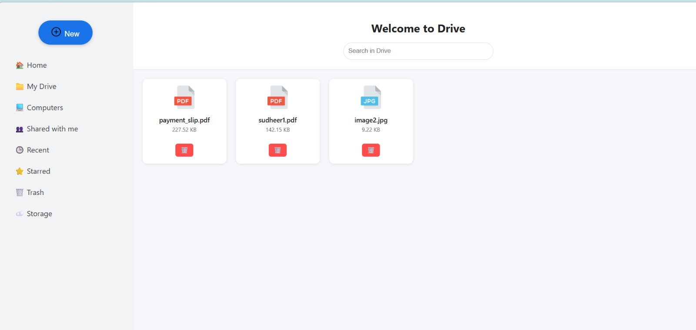

<h1>SpringBoot Cloud Drive Application</h1>
<b>
<or>
<li>Developed a Drive Application similar to cloud storage platforms to upload and manage files.</li>
<li>Built the backend using Spring Boot to handle file upload, storage, and retrieval APIs.</li>
<li>Implemented file upload and download functionality using REST endpoints.</li>
<li>Stored file metadata using Spring Data JPA with a database entity structure.</li>
<li>Saved uploaded files on the server file system (uploads directory).</li>
<li>Built a responsive frontend using React.js for file management UI.</li>
<li>Used Maven for backend dependency management and project build.</li>
</or>
</b> 
 <h2> Tech Stack </h2>
<b>Java | Spring Boot | Spring Data JPA | REST API | Maven | React.js </b> 

# That's all 🎊🎉  

## ScreenShots
   
